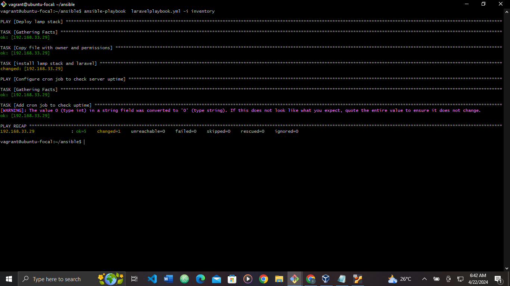
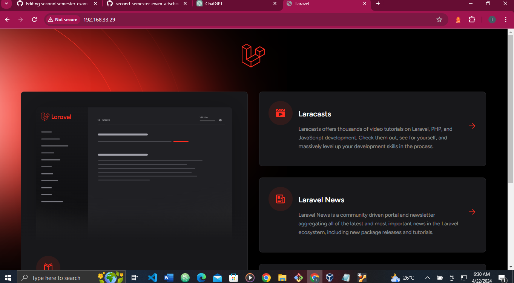

## Steps to automate the deployment of LAMP stack using bash script and apache 
### Step 1: Install LAMP stack
#### 1. Update package repository
`sudo apt update && sudo apt upgrade -y`
#### 2. Install Apache2
`sudo apt install apache2 -y`
#### 3. Install php amd its dependencies
`sudo apt-add-repository ppa:ondrej/php --yes`  
`sudo apt-get install php8 -y`  
`sudo apt install php php-pear php-common php-dev php-zip php-curl php-xmlrpc php-gd php-mysql php-mbstring php-xml libapache2-mod-php -y`
#### 4. Install mysql server
`sudo apt install mysql-server -y`  
`sudo apt install mysql-client`
#### 5. Install and set up composer dependencies 
`sudo curl  -sS https://getcomposer.org/installer |  php -q`  
`sudo mv composer.phar /usr/local/bin/composer`  
`sudo chmod +x /usr/local/bin/composer`
## Step 2: Clone the laravel github repo and setups
#### 1. Clone the laravel repo to the document root and set it up using composer
`cd /var/www/`  
`sudo git clone https://github.com/laravel/laravel.git`  
`cd /var/www/laravel/`   
`sudo composer install --optimize-autoloader --no-dev --no-interaction`  
#### 2. Change the ownership of the laravel directory to webserver user
`sudo chown -R www-data /var/www/laravel/storage`  
`sudo chown -R www-data /var/www/laravel/bootstrap`  
#### 3. Update .ENV file
`cd /var/www/laravel`  
`sudo cp .env.example .env`  
## Step 3: Setup mysql server  
#### 1. Create a database
`sudo mysql -uroot -e "CREATE DATABASE demo;"`  
`sudo mysql -uroot -e "CREATE USER 'demoAdmin'@'localhost' IDENTIFIED BY 'helloWorld12345-';"`  
`sudo mysql -uroot -e "GRANT ALL PRIVILEGES ON demo.* TO 'demoAdmin'@'localhost';"`  
#### 2. Insert configuration to .env file
`cd /var/www/laravel`    
`sudo sed -i '23,27 s/^#//' /var/www/laravel/.env`   
comment out line 23 to 27  
`sudo sed -i '22 s/=sqlite/=mysql/' /var/www/laravel/.env`  
`sudo sed -i '23 s/=127.0.0.1/=localhost/' /var/www/laravel/.env`  
`sudo sed -i '24 s/=3306/=3306/' /var/www/laravel/.env`  
`sudo sed -i '25 s/=laravel/=demo/' /var/www/laravel/.env`  
`sudo sed -i '26 s/=root/=demoAdmin/' /var/www/laravel/.env`  
`sudo sed -i '27 s/=/=helloWorld12345-/' /var/www/laravel/.env`
Insert the following chracters to the repective lines
## Step 4: Configure apache for laravel
#### 1. Create a new config file and insert setups
`sudo touch /etc/apache2/sites-available/laravel.conf`  
`sudo touch /tmp/tmp_file.config`  
`filename="/etc/apache2/sites-available/laravel.conf"`  
`tempfile="/tmp/temp_file.conf"`  
`text="<VirtualHost *:80>`  
   `ServerName localhost`  
   `DocumentRoot /var/www/laravel/public`  
   `<Directory /var/www/laravel>`  
      `Options Indexes FollowSymLinks`  
      `AllowOverride All`    
      `Require all granted`  
   `</Directory>`
   `ErrorLog \${APACHE_LOG_DIR}/error.log`  
   `CustomLog \${APACHE_LOG_DIR}/access.log combined`  
`</VirtualHost>"`  
`sudo mv "$tempfile" "$filename"`
#### 2. Generate encryptiom key
`cd /var/www/laravel`  
`sudo php artisan key:generate`  
`sudo php artisan storage:link`
## Step 5: Run migrations and seed to test if database is working
#### 1. Run migrations
`sudo php artisan migrate`
#### 2. Run seeds to fill tables with data
`sudo php artisan db:seed`
## Step 6: Restart apache
#### 1. Disable apache default page
`sudo a2dissite 000-default.conf`
#### 2. Enable laravel.conf page
`sudo a2ensite laravel.conf`
#### 3. Restart apache
`sudo systemctl restart apache2`
## Automating the shell script using ansible
#### 1. Create a task to copy the scriptfrom the master node to the slave node
- name: Deploy lamp stack  
  hosts: all  
  become: true   
  tasks:  
    `- name: Copy file with owner and permissions`  
      `ansible.builtin.copy:`  
          `src: /home/vagrant/altschool/exam.sh`  
           `dest: /home/vagrant/exam.sh`  
            `owner: root`  
              `group: root`  
                `mode: '0755'`
      
#### 2. Use the script module to run the task on the slave node 
    `- name: install lamp stack and laravel
      script: /home/vagrant/altschool/exam.sh`
#### 3. Configure cron job to check server up time
`- name: Configure cron job to check server uptime`  
  `hosts: all`  
  `become: yes`  
  `tasks:`  
   ` - name: Add cron job to check uptime`  
    `  cron:`  
     `   name: Check server uptime`  
      `  minute: 0`  
       ` hour: 0`   
        `job: /usr/bin/uptime >> /var/log/uptime.log 2>&1`  
        `state: present`
### Playbook Running
   
### Laravelapp Running

